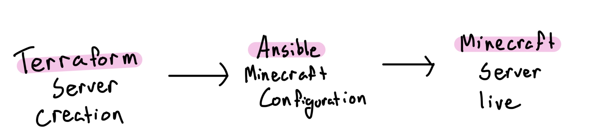
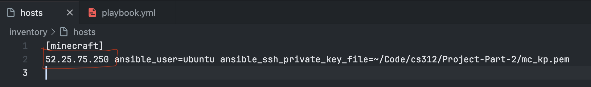

# Course Project Part 2
- Name: Jonathan Pham
- Student ID: 934-256-908
- Class: CS 312 System Administration
- Professor: Alexander Ulbrich

## Background: What will we do? How will we do it? 
As seen in the 8.2 Infrastructure As Code lecture, the last slide shows that we need to setup the infrastructure of the Minecraft server using Terraform instead of using the AWS GUI dashboard. And after setting up the infrastructure (EC2 instances) of the Minecraft server, we would need to configure the server to install and run the Minecraft server using Ansible. In order to complete this, I would need to create a Terraform script that sets up a valid EC2 server instance and then create a Ansible playbook script that configures the server I just created. 

## Requirements:
- What will the user need to configure to run the pipeline and what tools should be installed?

The user will need to configure their Terraform and Ansible scripts to run the pipeline. The tools required for are: **Terraform v1.8.5** (for provisioning), **Ansible v2.16.6** (for configuration), and the **AWS CLI** (for key pair creation). 

- Are there any credentials or CLI required?

Yes, the first is the AWS CLI credential in order for my local terminal to connect to AWS services, especially when using Terraform. This will be accessed through the Learner Lab module to get the credentials. The next credential is used for SSH key pair creation. In order for me to create an SSH key pair through AWS CLI, I would enter this command (ChatGPT): `aws ec2 create-key-pair --key-name mc_kp --query 'KeyMaterial' --output text --region us-west-2 > ~/Code/cs312/Project-Part-2/mc_kp.pem`

The command above is a AWS CLI command to create a key pair, which will be named `mc_kp`. The command will also grab the private key and will associate the key pair to the given region (us-west-2). The private key .pem file will be stored to my repository to be used to connect to SSH using Ansible. (key not on GitHub for security) 

In addition to creating the key pair, make sure to change the permissions of the key file to read only: `chmod 400 ~/Code/cs312/Project-Part-2/mc_kp.pem`

- Should the user set environment variables or configure anything?

The only environment variables that the user should configure is to set the AWS CLI credentials that was copied in the Learner Lab module to `~/.aws/credentials`. (Note: Every time you start a new lab session, the credentials change)

## Diagram of the major steps in the pipeline. 

## List of commands to run, with explanations.
1. Assuming the user has already done the AWS key pair generation commands seen above, created a working Terraform script. Make sure that Terraform is [installed first](https://developer.hashicorp.com/terraform/tutorials/aws-get-started/install-cli) 
2. Make sure the user is in the working directory with the Terraform script and enter `terraform init` to initizlize the backend.
3. Then enter `terraform apply` to deploy an EC2 instance on AWS. The `main.tf` file will create a server with the correct security groups to connect to Minecraft, as well as a configured elastic IP. The `outputs.tf` file will output the IP address in which we will take note of. Example: `instance_public_ip = "54.149.76.41"`
4. Copy the `instance_public_ip` value and navigate to the `./inventory/hosts` file and replace/paste the placeholder IP address with the new IP address created through the recent `terraform apply`

5. Now that the EC2 instance is active, we can run the Ansible playbook to configure the instance to open a Minecraft server: `ansible-playbook -i inventory/hosts playbook.yml`
    
## How to connect to the Minecraft server once it's running?

To connect, copy the `instance_public_ip` address to use soon. Once you are in the Minecraft main menu, click on the **Mulitplayer** button and then click on **Direction Connection** and then paste the IP address when the screen prompts for a IP address. You can also check for an `nmap` request to see that the Minecraft server is open: `nmap -sV -Pn -p T:25565 <instance_public_ip>`

## Sources:

- Ubuntu: [Amazon EC2 AMI Locator](https://cloud-images.ubuntu.com/locator/ec2/) (To find correct Ubuntu AMI)
- Hashicorp: [Build infrastructure](https://developer.hashicorp.com/terraform/tutorials/aws-get-started/aws-build) (To use in README.md)
- Terraform: [EIP](https://registry.terraform.io/providers/hashicorp/aws/latest/docs/resources/eip) (To use Elastic IP in Terraform script)
- Terraform: [EIP Association](https://registry.terraform.io/providers/hashicorp/aws/latest/docs/resources/eip_association) (To use Elastic IP in terraform Script)
- Canvas:  [Course Project Part 1](https://canvas.oregonstate.edu/courses/1958308/assignments/9593748) (To use nmap instructions)
- Medium: [Start your Minecraft Server on Amazon Web Services (AWS) in 2023](https://medium.com/@cedric.lemercierlaos/start-your-minecraft-server-on-amazon-web-services-aws-d35f846a2d7c) (To use systemmd service file, also used in Project Part 1)
- MultiMC Github: [Using the right Java](https://github.com/MultiMC/Launcher/wiki/Using-the-right-Java) (Used to identify what OpenJDK version to install in playbook)
- Github: [Ansible Playbooks for AWS EC2 Demo](https://github.com/adulbrich/demo-ansible-playbook-ec2/tree/main) (Used file structure to create host file for Ansible)
- ChatGPT (Used to help writing Ansible/Terraform scripts)

